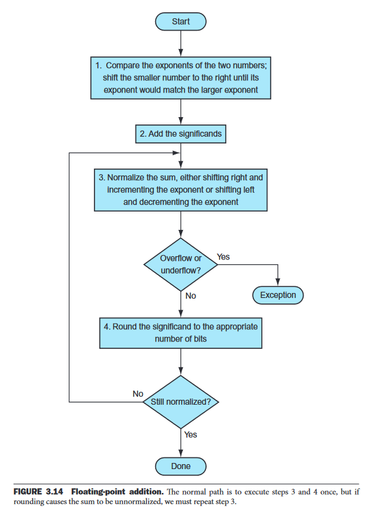
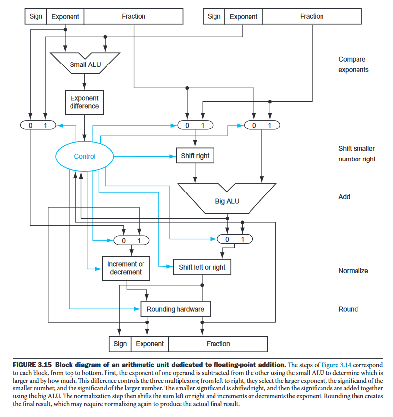
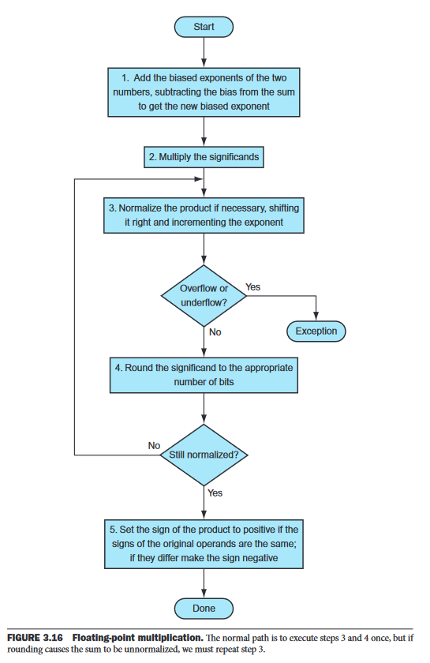

# Floating Point Unit Design

In this document, we will discuss the design of a floating point unit (FPU) which could perform the main floating-point operations.

## Table of Contents
1. [Features](#features)
1. [Algorithm](#algorithm)
    1. [General Algorithm](#general-algorithm)
    1. [Addition Algorithm](#addition-algorithm)
    1. [Subtraction Algorithm](#subtraction-algorithm)
    1. [Multiplication Algorithm](#multiplication-algorithm)
    1. [Division Algorithm](#division-algorithm)
1. [Modules](#modules)
    1. [General Algorithm Modules](#general-algorithm-modules)
    1. [Addition Algorithm Modules](#addition-algorithm-modules)
    1. [Subtraction Algorithm Modules](#subtraction-algorithm-modules)
    1. [Multiplication Algorithm Modules](#multiplication-algorithm-modules)
    1. [Division Algorithm Modules](#division-algorithm-modules)
    1. [Common Modules](#common-modules)

## Features
- Single-precision (Sp) and double-precision (Dp) floating point unit (FPU)
- Detecting and handling of special cases
- Addition
- Subtraction
- Multiplication
- Division

## Algorithm
### General Algorithm
The general algorithm for all operations is as follows:
1. Check for special numbers and output accordingly, otherwise continue
1. Perform operation
1. Normalize result
1. Check for overflow/underflow
1. Round result
1. Output result

Steps 3 to 5 may be performed more than once.

### Addition Algorithm

We will use the algorithm described in Chapter 4 of the book [Computer Organization and Design](https://drive.google.com/file/d/1F1e6T8LvDz1w0ox9NKu9N1k5KbDTgO5l/view). A flowchart of the algorithm is shown below:

A schematic of the hardware implementation of the algorithm is shown below:

### Subtraction Algorithm

The algorithm for subtraction is similar to the algorithm for addition, except that the Big ALU will perform subtraction instead of addition.

### Multiplication Algorithm

We will use the algorithm described in Chapter 4 of the book [Computer Organization and Design](https://drive.google.com/file/d/1F1e6T8LvDz1w0ox9NKu9N1k5KbDTgO5l/view). A flowchart of the algorithm is shown below:

We note that the multiplication differs from the addition and subtraction algorithms in the following ways:
- The exponents are added instead of subtracted (with subtraction of bias)
- No need for shifting the mantissa of the smaller operand
- The Big ALU performs multiplication instead of addition/subtraction
- The Big ALU doesn't evaluate the sign bit

However, the normalization, overflow/underflow checking, and rounding steps are the same as in the addition and subtraction algorithms.

### Division Algorithm

Note: The division algorithm is not yet implemented.

## Modules

- [General Algorithm Modules](#general-algorithm-modules)
- [Addition Algorithm Modules](#addition-algorithm-modules)
- [Subtraction Algorithm Modules](#subtraction-algorithm-modules)
- [Multiplication Algorithm Modules](#multiplication-algorithm-modules)
- [Division Algorithm Modules](#division-algorithm-modules)
- [Common Modules](#common-modules)

### **General Algorithm Modules**
- `fpu`: The top-level module
- `fpu_sp`: The single-precision version of the FPU
- `fpu_dp`: The double-precision version of the FPU
- `fpu_sp_detector`: The single-precision version of the special number detector
- `fpu_dp_detector`: The double-precision version of the special number detector

### **Addition Algorithm Modules**
- `fpu_sp_adder`: The single-precision version of the adder
- `fpu_dp_adder`: The double-precision version of the adder
- To compare the exponents, we will use the `fpu_sp_comparator` and `fpu_dp_comparator` which will output the result of the comparison in the form of a 2-bit number, where `00` means that the first operand is greater, `01` means that the second operand is greater, and `10` means that the operands are equal. And also the exponent difference in order to shift the mantissa of the smaller operand.
- `fpu_big_alu`: A Big ALU which will perform addition/subtraction/multiplication on the significands of the operands depending on the control signal. (if the implementation won't differ between the single-precision and double-precision versions, we will use the same module for both versions)
- `fpu_xp_normalizer`: Normalize the result of the addition/subtraction/multiplication.

- `fpu_xp_overflow_underflow_checker`: Check for overflow/underflow and output the result.
- `fpu_xp_rounder`: Round the result.
- `fpu_xp_adder_controller`: Controller which will control the adder algorithm and send the appropriate control signals to each module.

### **Subtraction Algorithm Modules**
- `fpu_sp_subtractor`: The single-precision version of the subtractor
- `fpu_dp_subtractor`: The double-precision version of the subtractor
- `fpu_xp_subtractor_controller`: Controller which will control the subtractor algorithm and send the appropriate control signals to each module.
- `fpu_xp_comparator`: The comparator which will be used to compare the exponents of the operands.
- `fpu_xp_normalizer`: Normalize the result of the subtraction.
- `fpu_xp_overflow_underflow_checker`: Check for overflow/underflow and output the result.
- `fpu_xp_rounder`: Round the result.

### **Multiplication Algorithm Modules**
- `fpu_sp_multiplier`: The single-precision version of the multiplier
- `fpu_dp_multiplier`: The double-precision version of the multiplier
- `fpu_xp_multiplier_controller`: Controller which will control the multiplier algorithm and send the appropriate control signals to each module.
- `fpu_xp_exponent_adder`: Add the exponents of the operands.
- `fpu_xp_normalizer`: Normalize the result of the multiplication.
- `fpu_xp_overflow_underflow_checker`: Check for overflow/underflow and output the result.
- `fpu_xp_rounder`: Round the result.
- `fpu_big_alu`: A Big ALU which will perform multiplication on the significands of the operands.
- `fpu_xp_sign_bit_evaluator`: Evaluate the sign bit of the result.

### **Division Algorithm Modules**
- `fpu_sp_divider`: The single-precision version of the divider
- `fpu_dp_divider`: The double-precision version of the divider
- `fpu_xp_divider_controller`: Controller which will control the divider algorithm and send the appropriate control signals to each module.
- To be continued...

### **Common Modules Between all Algorithms**

- `fpu_xp_comparator`: The comparator which will be used to compare the exponents of the operands, is common between addition and subtraction algorithms.

- `fpu_xp_normalizer`: The normalizer which will be used to normalize the result of the addition/subtraction/multiplication, is common between all algorithms.

- `fpu_xp_overflow_underflow_checker`: The overflow/underflow checker which will be used to check for overflow/underflow and output the result, is common between all algorithms.

- `fpu_xp_rounder`: The rounder which will be used to round the result, is common between all algorithms.

- `fpu_xp_sign_bit_evaluator`: The sign bit evaluator which will be used to evaluate the sign bit of the result, is common between multiplication and division algorithms.

### **Common Modules Between Single-precision and Double-precision Algorithms**

- 